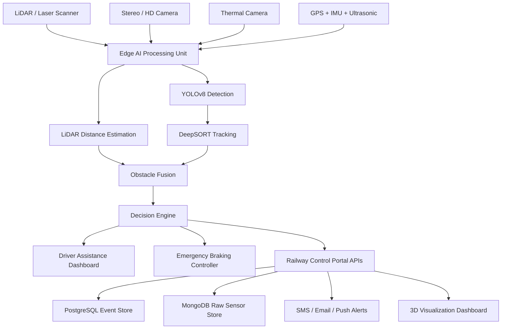
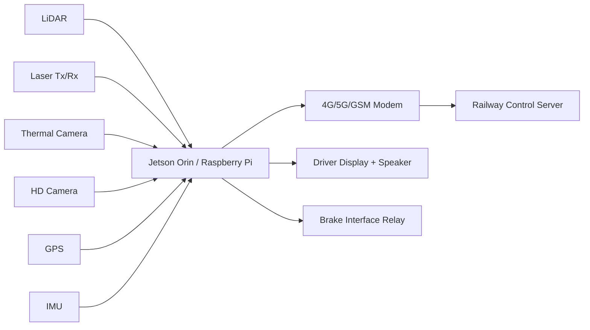
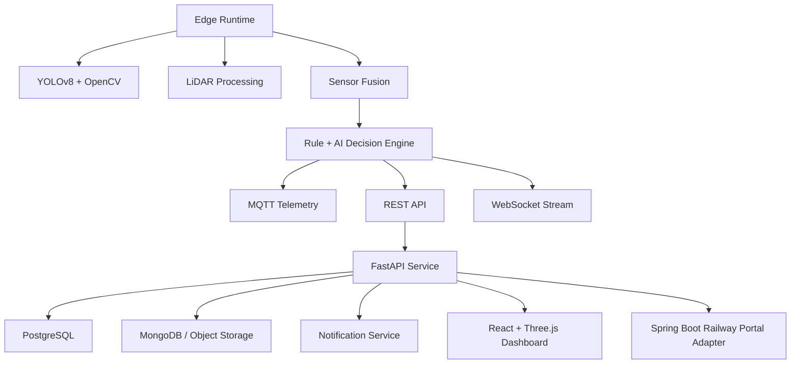
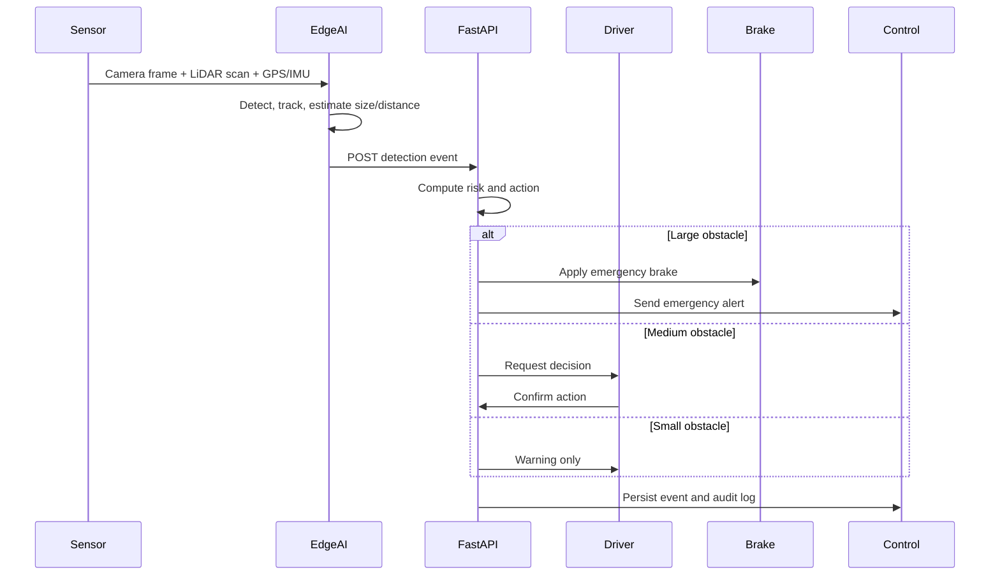
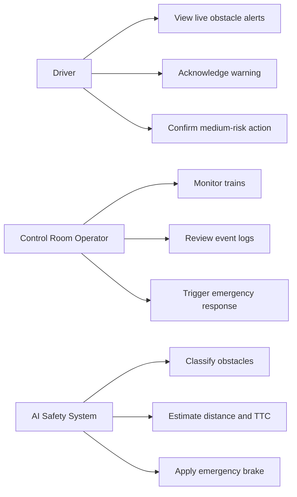

# Architecture Diagrams

## Complete System Architecture

```mermaid
flowchart TD
    A["LiDAR / Laser Scanner"] --> E["Edge AI Processing Unit"]
    B["Stereo / HD Camera"] --> E
    C["Thermal Camera"] --> E
    D["GPS + IMU + Ultrasonic"] --> E
    E --> F["YOLOv8 Detection"]
    E --> G["LiDAR Distance Estimation"]
    F --> H["DeepSORT Tracking"]
    G --> I["Obstacle Fusion"]
    H --> I
    I --> J["Decision Engine"]
    J --> K["Driver Assistance Dashboard"]
    J --> L["Emergency Braking Controller"]
    J --> M["Railway Control Portal APIs"]
    M --> N["PostgreSQL Event Store"]
    M --> O["MongoDB Raw Sensor Store"]
    M --> P["SMS / Email / Push Alerts"]
    M --> Q["3D Visualization Dashboard"]
```

## Hardware Architecture

```mermaid
flowchart LR
    S1["LiDAR"] --> Jetson["Jetson Orin / Raspberry Pi"]
    S2["Laser Tx/Rx"] --> Jetson
    S3["Thermal Camera"] --> Jetson
    S4["HD Camera"] --> Jetson
    S5["GPS"] --> Jetson
    S6["IMU"] --> Jetson
    Jetson --> Modem["4G/5G/GSM Modem"]
    Jetson --> DriverUI["Driver Display + Speaker"]
    Jetson --> Brake["Brake Interface Relay"]
    Modem --> Control["Railway Control Server"]
```

## Software Architecture

```mermaid
flowchart TB
    Edge["Edge Runtime"] --> Vision["YOLOv8 + OpenCV"]
    Edge --> Lidar["LiDAR Processing"]
    Edge --> Fusion["Sensor Fusion"]
    Fusion --> Decision["Rule + AI Decision Engine"]
    Decision --> MQTT["MQTT Telemetry"]
    Decision --> REST["REST API"]
    Decision --> WS["WebSocket Stream"]
    REST --> FastAPI["FastAPI Service"]
    FastAPI --> DB["PostgreSQL"]
    FastAPI --> Raw["MongoDB / Object Storage"]
    FastAPI --> Notify["Notification Service"]
    FastAPI --> React["React + Three.js Dashboard"]
    FastAPI --> Spring["Spring Boot Railway Portal Adapter"]
```

## Sequence Diagram

```mermaid
sequenceDiagram
    participant Sensor
    participant EdgeAI
    participant API as FastAPI
    participant Driver
    participant Brake
    participant Control
    Sensor->>EdgeAI: Camera frame + LiDAR scan + GPS/IMU
    EdgeAI->>EdgeAI: Detect, track, estimate size/distance
    EdgeAI->>API: POST detection event
    API->>API: Compute risk and action
    alt Large obstacle
        API->>Brake: Apply emergency brake
        API->>Control: Send emergency alert
    else Medium obstacle
        API->>Driver: Request decision
        Driver->>API: Confirm action
    else Small obstacle
        API->>Driver: Warning only
    end
    API->>Control: Persist event and audit log
```

## Use Case Diagram

```mermaid
flowchart LR
    Driver["Driver"] --> UC1["View live obstacle alerts"]
    Driver --> UC2["Acknowledge warning"]
    Driver --> UC3["Confirm medium-risk action"]
    Control["Control Room Operator"] --> UC4["Monitor trains"]
    Control --> UC5["Review event logs"]
    Control --> UC6["Trigger emergency response"]
    System["AI Safety System"] --> UC7["Classify obstacles"]
    System --> UC8["Estimate distance and TTC"]
    System --> UC9["Apply emergency brake"]
```
