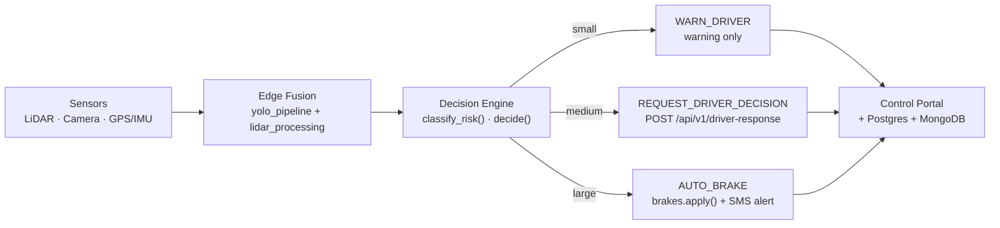
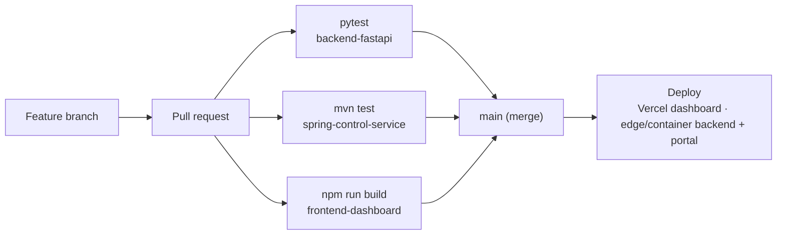
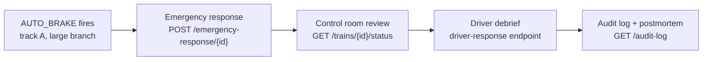

# Signal Chain — Project Outlook

**Status:** Detection pipeline (simulated) · Decision engine (implemented) · Control portal (implemented) · Persistence + auth + CI (implemented) · Physical prototype (planned, see [prototype-build-plan.md](prototype-build-plan.md)) · Certification (not started)

## Core Idea

A train travelling at 22 m/s needs roughly 285 m to stop under a 0.85 m/s² service deceleration — and a driver reacting on sight alone loses most of that margin before the brake is even touched. The system's whole reason to exist is to close that gap: fuse LiDAR range, camera classification, and GPS/IMU heading at the edge, turn it into a risk figure in milliseconds, and route the decision to whoever — driver, brake relay, or control room — needs to act on it first.

It doesn't treat every obstacle the same. A wind-blown `plastic_bag` and a `derailment` both trigger a detection, but only one should ever pull the brake. The decision engine's three-tier risk model exists to keep the system from crying wolf while still braking automatically when it matters, and every action it takes is logged so a human can review the call afterward.

Per the project's own safety note, this is a decision-support simulator today, not a certified safety system: the outlook below treats that gap — from prototype to something a railway authority could actually sign off on — as the work, not an afterthought.

### What each risk tier actually does

- **Large** — truck, derailment, rockslide, or bbox area ≥ 6 m². Action: `AUTO_BRAKE`, no driver confirmation needed.
- **Medium** — person, animal, vehicle, or area ≥ 1 m². Action: `REQUEST_DRIVER_DECISION`, driver must confirm.
- **Small** — debris, branch, loose object. Action: `WARN_DRIVER`, operation continues.

## Complete Workflow Framework

Nothing here runs as a single pipeline. The obstacle-to-brake loop runs continuously in production; the delivery loop is how changes reach that loop safely; the incident loop is how a brake event gets reviewed and fed back into both of the other two.

### A. Operational safety loop

Runs once per detection, end to end, on the order of milliseconds. This is `backend-fastapi`.

Every detection forks at the decision engine by risk tier, and every branch — whether it only warned the driver or pulled the brake — still reports back to the same portal and event stores.

### B. Delivery workflow

How a change to any of the three services above reaches production.

All three services share one pull request lane; a merge to `main` only ships once every suite the change touches has passed.

### C. Safety & incident loop

What happens after track A fires `AUTO_BRAKE` — closes back into the roadmap, not just a log entry.

Audit + postmortem feeds `testing-plan.md` and the roadmap below. The only loop of the three that closes on itself: a real brake event is reviewed, debriefed, logged, and turned into backlog — it doesn't just sit in a table.

## Outlook — Four Phases From Simulator to Certifiable

Ordered by dependency, not ambition — each phase is what the next one needs already working.

### 01 · Harden the current loop — done
*why now — every later phase depends on this one being real, not simulated*

- ✅ `backend-fastapi` persists events to Postgres via [store.py](../backend-fastapi/app/store.py) (falls back to in-memory if the DB isn't reachable, so a fresh device still boots)
- ✅ `security.py` issues JWTs and gates `/driver-response` and `/brake/release` by role; `notification.py` now actually calls the portal's `/api/portal/alerts` instead of only logging
- ✅ [.github/workflows/ci.yml](../.github/workflows/ci.yml) runs pytest, `mvn test`, and the frontend build on every PR
- ⏳ still open: portal's own `AlertStore` is in-memory only, and there's no login UI in `frontend-dashboard` yet — both fine for a bench demo, worth closing before anything wider

### 02 · Perception upgrade
*why now — the risk model is only as good as what it can see and how fast*

- TensorRT-optimized YOLOv8/YOLOv10 on Jetson hardware
- DeepSORT or ByteTrack multi-object tracking, replacing single-frame classification
- Radar fusion for fog, rain, and dust robustness alongside LiDAR + camera

### 03 · Domain fidelity
*why now — a single 0.85 m/s² deceleration constant doesn't hold across a real fleet*

- Real train speed and braking curves by train type and load
- Redundant brake command verification before `AUTO_BRAKE` reaches hardware
- V2X alerts between trains and stations sharing the same track section

### 04 · Certification path
*why now — this is what turns "decision-support simulator" into something a railway authority can sign off on*

- Formal safety-case documentation and SIL analysis (EN 50126 / 50128 / 50129, IEC 61508)
- Digital twin track maps (CesiumJS + GIS) for scenario replay and audit
- Active learning loop on low-confidence detections flagged in track C's postmortems

## Safety Note

This remains a final-year / project-grade reference implementation and simulator. Real railway braking, signaling, and safety-critical deployment require certified hardware, fail-safe control systems, railway authority approval, formal verification, redundancy, and compliance with EN 50126, EN 50128, EN 50129, IEC 61508, and local railway regulations — which is exactly what phase 04 above is scoped to close.

## Links

- GitHub repository: https://github.com/nohithreddy/railway-obstacle-detection
- Live dashboard: https://frontend-dashboard-pied.vercel.app
- Figma mockup: https://www.figma.com/design/djhbfdvqNsDoG5vVZCfy5j

---
*Outlook drawn from the current state of the repository, not a target spec. Interactive version: [Signal Chain artifact](https://claude.ai/artifact/SXyEViTqLsf4fXwSRhsKg9).*
